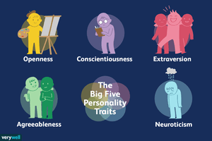

# Gender Prediction with Big 5 Personality Traits


     
In the field of clinical psychology there is a generally accepted model known as the "Big 5 Personality Traits" which as the title suggests breaks down human personality along 5 axes: 

- **O**penness to experience : _inventive/curious vs. consistent/cautious_
- **C**oncientiousness : _efficient/organized vs. easy-going/careless_
- **E**xtraversion : _outgoing/energetic vs. solitary/reserved_
- **A**greeableness : _friendly/compassionate vs. challenging/detached_
- **N**euroticism : _sensistve/nervous vs. secure/confident_

Through the use of simple self-reported adjective/charactersitic tests, a percentile score can be determined for each trait. These percentile scores can then be used as feature sets in classification algorithms to predict sex (which is also reported in the test).

The large dataset used for model training and testing is from the [Open Source Psychometrics Project](https://openpsychometrics.org/) \[[raw_data](https://openpsychometrics.org/_rawdata/)\] which:
> _provides a collection of interactive personality tests with detailed results that can be taken for personal entertainment or to learn more about personality assessment_
 
At the time of writing this README there are **19719** responses present in _data.csv_:
````r
data %>% 
    group_by(gender) %>%
    summarise(n_rows = length(gender))

# A tibble: 4 x 2
  gender n_rows
   <int>  <int>
1      0     24 # no response
2      1   7608 # male
3      2  11985 # female
4      3    102 # other
````
The test responses are initially stored in a 57 column dataframe (author's responses shown below in list) with extraneous (though still interesting to explore) data regarding race, age, dominant hand, ISO country code, etc. The various levels and responses of these columns can be investigated further in _codebook.txt_.
````r
author <- c(3,21,1,1,1,2,CAN,
            2,2,4,3,4,2,2,2,4,2, # openness
            1,4,2,2,1,1,1,2,2,3, # concientiousness
            2,3,1,2,2,3,2,3,2,3, # extraversion
            3,2,4,1,4,1,4,2,4,4, # agreeableness
            4,1,4,1,3,2,5,4,4,4) # neuroticism
````
The questions related to each trait are summed and then a percentile calculated for each trait relative to the other responses. There is some unexciting data transformation and grouping into train and test sets, which are then fed to the following algorithms:
 - [Mixture Discriminant Analysis](https://en.wikipedia.org/wiki/Linear_discriminant_analysis#Multiclass_LDA) : \[[_mda package_](https://cran.r-project.org/web/packages/mda/index.html)\]
 - [Quadratic Discriminant Analysis](https://en.wikipedia.org/wiki/Quadratic_classifier#Quadratic_discriminant_analysis) : \[[_MASS package_](https://cran.r-project.org/web/packages/MASS/index.html)\]
 - [Regularized Discriminant Analysis](https://en.wikipedia.org/wiki/Linear_discriminant_analysis) : \[[_klaR package_](https://cran.r-project.org/web/packages/klaR/index.html)\]
 - [Neural Network](https://en.wikipedia.org/wiki/Artificial_neural_network) : \[[_nnet package_](https://en.wikipedia.org/wiki/Artificial_neural_network)\]
 - [Flexible Discriminant Analysis](https://en.wikipedia.org/wiki/Linear_discriminant_analysis) : \[[_mda package_](https://cran.r-project.org/web/packages/mda/index.html)\]
 - [Support Vector Machine](https://en.wikipedia.org/wiki/Support_vector_machine) : \[[_kernlab package_](https://en.wikipedia.org/wiki/Support_vector_machine)\]
 - [k-Nearest Neighbours](https://en.wikipedia.org/wiki/K-nearest_neighbors_algorithm) : \[[_caret package_](https://cran.r-project.org/web/packages/caret/index.html)\]
 - [Naive Bayes](https://en.wikipedia.org/wiki/Naive_Bayes_classifier) : \[[_e1071 package_](https://cran.r-project.org/web/packages/e1071/index.html)\]
 - Additionally, a custom multi-layer ANN was developed using the [_keras_](https://cran.r-project.org/web/packages/keras/index.html) package

## Some Data Exploration

  
## Setup + Running
First, download and install `R` 3.5.x from https://cran.rstudio.com/  
  
Next, download and run the `RStudio` installer for your platform from the organization's [download page](https://www.rstudio.com/products/rstudio/download/#download)  
  
Open `RStudio` and run through initial configuration steps such as selecting your CRAN mirror (see earlier link for more information on their place in the `R` ecosystem). 
  
With the IDE set up you can go ahead and fork/download the repository, ensuring the file structure is maintained. Once this is complete go ahead and open up `big-5-gender-predictor-notebook.Rmd`  
  
The final step is to copy the below codeblock into the console (don't worry, its only installing the necessary packages for the report to run):  
````r
install.packages('mda')
install.packages('MASS')
install.packages('klaR')
install.packages('nnet')
install.packages('kernlab')
install.packages('caret')
install.packages('e1071')
install.packages("tidyverse")
install.packages("keras")
````  
There will be some minor conflicts between the packages and required packages of the above, but these can be ignored.  
  
And you're done! Hit `Ctrl + Shift + Enter` to individually execute the code blocks denoted by the ` ```{r}  ``` ` wrapper or `Ctrl + Alt + P` to execute all code blocks above the cursor

## Adding Your Test Data
Appending your personal data for the algorithms to predict on is quite simple:  
1. Open your local copies of `./data/custom_data.csv` and `./notebook.txt`  
  
2. Observing the headers of the `.csv`, follow the commentary in the codebook and answer all personality and extraneous questions, seperating answers with a single comma. 
> Note: It is important that all 58 columns be provided a value else errors will be thrown due to inconsistent row sizing. Obviously the only questions that require a valid answer are the 50 columns prefaced by an O, C, E, A, or N, and the gender column.  
  
3. Run the report as explained above in _Setup + Running_, your custom set of predictions will be available at the bottom of the report along with other custom users!
